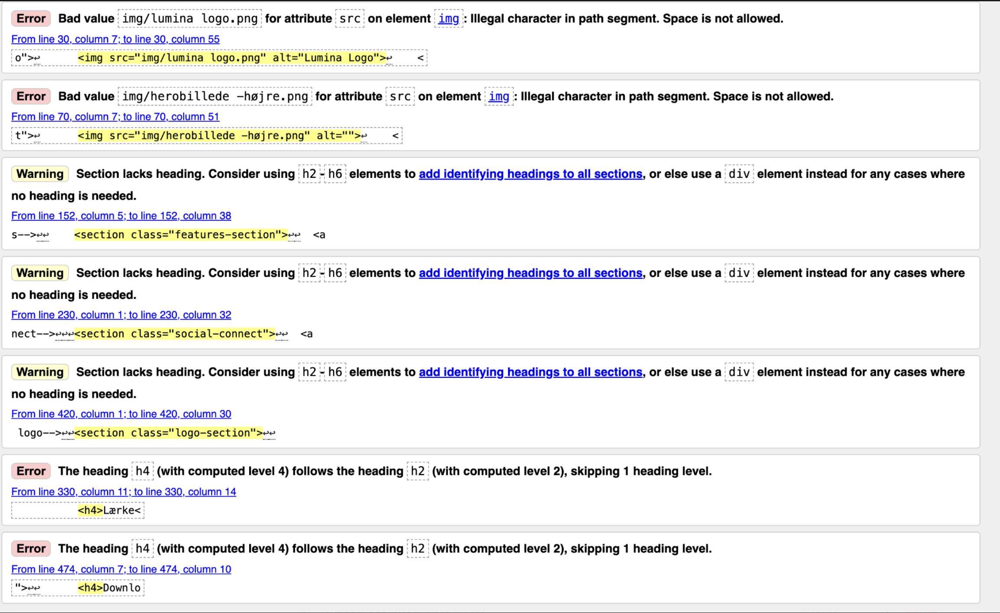
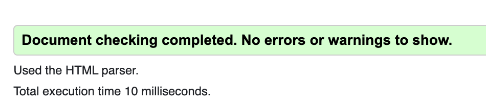

# LUMINA Audio – Programmerings-dokumentation

## Kort beskrivelse af projektet

Mit projekt er en landingpage for højtaleren LUMINA One. Formålet med projektet er at skabe en moderne og brugervenlig produktside, hvor brugeren hurtigt kan få et indtryk af produktets design, funktioner og farvevalg.

Projektet er lavet med HTML, CSS og JavaScript. HTML bruges til at strukturere indholdet på siden, CSS bruges til styling og layout, og JavaScript bruges til at skabe interaktion på siden.

Brugeren kan blandt andet se produktinformation, navigere rundt på siden og skifte mellem forskellige farver på højtaleren. Projektet arbejder primært med billeddata, farvenavne og baggrundsfarver, som ændres ud fra brugerens valg.

## Fil- og mappestruktur

Projektet er organiseret i forskellige filer og mapper for at gøre koden mere overskuelig.

- `index.html` indeholder selve strukturen på landingpagen, fx navbar, hero-sektion, produktsektion, feature-sektioner og footer.

- `css/style.css` indeholder alt styling til siden, fx farver, skrifttyper, layout, spacing, hover-effekter og responsivt design.

- `js/script.js` indeholder JavaScript-koden, som gør siden interaktiv.

- `img`-mappen indeholder billeder, logo, favicon og produktbilleder.

Jeg har valgt denne struktur, fordi det gør projektet nemmere at finde rundt i. HTML, CSS, JavaScript og billeder ligger adskilt, så projektet bliver mere overskueligt og lettere at rette i.

## Validering af CSS

Jeg har valideret min CSS-fil med W3C CSS Validator. Den fil, jeg har valideret, er min `style.css`.

Formålet med valideringen var at undersøge, om der var fejl i min CSS-syntaks. Hvis der opstod fejl eller advarsler, rettede jeg dem ved at gennemgå den linje, validatoren pegede på. Det kunne fx være manglende semikolon, forkert property eller en stavefejl i koden.

Valideringen hjalp mig med at sikre, at min CSS var skrevet korrekt og kunne læses af browseren.

## Validering af HTML

Jeg har valideret min HTML-fil med W3C Markup Validation Service. Den fil, jeg har valideret, er `index.html`.

Formålet var at kontrollere, om min HTML havde en korrekt struktur. Jeg brugte valideringen til at finde fejl som fx manglende afsluttende tags, forkert brug af elementer eller problemer med nesting.

Efter valideringen rettede jeg fejlene, så HTML-strukturen blev mere semantisk og korrekt. Det gjorde også koden mere overskuelig og bedre i forhold til tilgængelighed.





## JavaScript datastruktur

I mit JavaScript arbejder jeg med data om produktets forskellige farver. Dataene består blandt andet af produktbilleder, farvenavne og gradients/baggrundsfarver.

Jeg bruger dataene til at ændre indholdet på siden, når brugeren vælger en farve. Det passer godt til projektet, fordi landingpagen skal vise det samme produkt i flere forskellige varianter.

Dataene bruges sammen med funktioner og event listeners, så siden reagerer på brugerens handlinger, fx når brugeren klikker eller holder musen over en farveknap.

## Eksempel på JavaScript-kode

```js
function chooseColor(button, image, color, gradient) {
    button.addEventListener("click", function () {
        productImage.src = image;
        colorName.textContent = color;
        productSection.style.background = gradient;
    });
}